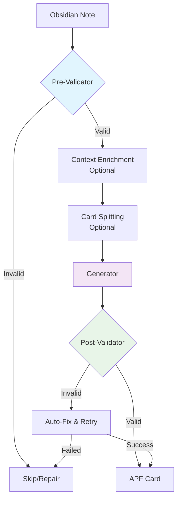
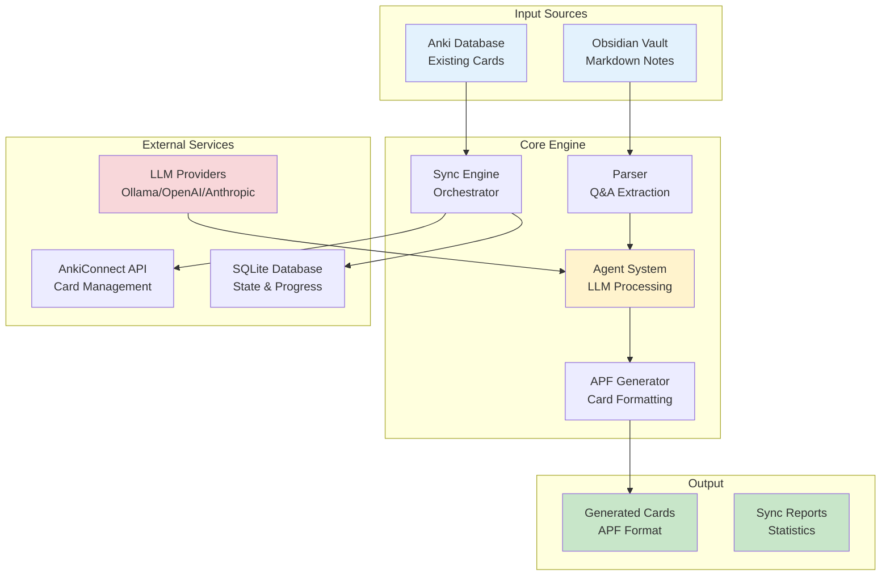
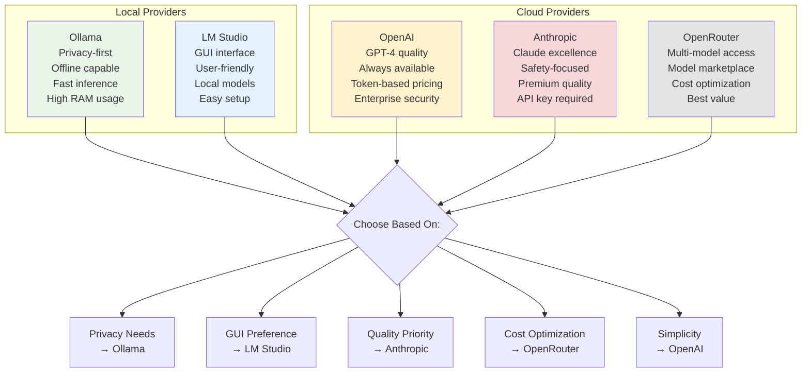

# Obsidian to Anki APF Sync

Sync Obsidian Q&A notes to Anki flashcards using LLM generation with multi-agent validation.

[]()
[]()
[]()
[](https://github.com/astral-sh/ruff)
[](https://opensource.org/licenses/BSD-3-Clause)

## Features

-   **Bidirectional Sync**: Sync between Obsidian notes and Anki cards
-   **Multi-Agent System**: LangGraph and PydanticAI orchestration
-   **Multi-Provider Support**: Ollama, OpenAI, Anthropic, OpenRouter, LM Studio
-   **Memory Learning**: Continuous quality improvement via patterns
-   **Privacy-First**: 100% local processing with Ollama
-   **Bilingual**: English/Russian with auto-detection
-   **Progress Tracking**: Resumable syncs with reporting
-   **Security**: Path validation, API protection, input sanitization
-   **Quality Assurance**: Multi-stage validation with auto-fix
-   **RAG**: Retrieval-augmented generation
-   **Batch Operations**: Efficient bulk processing with rollback
-   **APF v2.1**: Strict compliance with Anki Prompts Format
-   **Validation Suite**: Note validation and repair tools
-   **Task Queue**: Redis-backed queue for resilient parallel processing


## Table of Contents

-   [Features](#features)
-   [Multi-Agent Architecture](#multi-agent-architecture)
-   [System Architecture](#system-architecture)
-   [Data Flow](#data-flow)
-   [Quick Start](#quick-start)
-   [Providers Comparison](#providers-comparison)
-   [Commands](#commands)
-   [Development](#development)
-   [Security Features](#security-features)
-   [Troubleshooting](#troubleshooting)
-   [Documentation](#documentation)
-   [License](#license)

## Multi-Agent Architecture



**Benefits**:

-   **Performance**: 15-20% faster via early rejection
-   **Quality**: Multi-stage validation with auto-correction
-   **Resilience**: Auto-retry with different strategies
-   **Learning**: Pattern recognition improves over time
-   **Privacy**: 100% local processing with Ollama

## System Architecture



## Memory Learning

Advanced memory capabilities for continuous quality improvement:

-   **Pattern Recognition**: Learns successful generation patterns per topic
-   **User Preferences**: Adapts to user preferences for style and difficulty
-   **Quality Feedback**: Uses memorization assessments to optimize generations
-   **Intelligent Routing**: Auto-selects best AI agent per content

**Benefits**: 20-30% quality improvement, personalization, continuous learning.

## Data Flow

````mermaid
sequenceDiagram
    participant O as Obsidian Vault
    participant P as Parser
    participant V as Pre-Validator
    participant G as Generator
    participant PV as Post-Validator
    participant F as APF Formatter
    participant A as AnkiConnect
    participant D as SQLite DB

    O->>P: Scan for .md files
    P->>V: Extract Q&A pairs
    V->>V: Structure validation
    V->>G: Valid notes
    G->>PV: Generate cards
    PV->>PV: Quality check
    PV->>F: Valid cards
    F->>A: Format as APF
    A->>A: Add/Update cards
    A->>D: Store sync state
    D->>D: Track progress

    Note over V,PV: Auto-retry on failure
    Note over G: Memory-enhanced<br/>pattern learning
    Note over A: Transaction rollback<br/>on errors

## Quick Start

### Prerequisites

-   Python 3.13+
-   Anki with AnkiConnect plugin
-   uv package manager (recommended) or pip

### Installation

```bash
# Install uv
curl -LsSf https://astral.sh/uv/install.sh | sh

# Setup
git clone https://github.com/po4yka/obsidian-to-anki.git
cd obsidian-to-anki
uv sync --all-extras
source .venv/bin/activate

# Or with pip
pip install -e .
````

### Anki Setup

1. Install [Anki](https://apps.ankiweb.net/)
2. Install AnkiConnect addon (code: `2055492159`)
3. Restart Anki

### Configuration

#### 1. Choose LLM Provider

**Local (Recommended)** - Ollama:

```bash
brew install ollama
ollama serve
ollama pull llama3.2:3b qwen2.5:7b qwen2.5:14b
```

**Cloud** - OpenAI:

```bash
export OPENAI_API_KEY="sk-..."
```

**Cloud** - Anthropic:

```bash
export ANTHROPIC_API_KEY="sk-ant-..."
```

#### 2. Create Config File

Create `config.yaml`:

```yaml
# Vault config
vault_path: "~/Documents/ObsidianVault"
source_dir: "Notes"
anki_deck_name: "My Deck"

# Provider settings
llm_provider: "ollama" # Options: ollama, openai, anthropic, openrouter, lm_studio

# Agent config
use_langgraph: true # LangGraph orchestration
use_pydantic_ai: true # Structured AI responses

# Models
pre_validator_model: "llama3.2:3b" # Fast model
generator_model: "qwen2.5:14b" # Main model
post_validator_model: "qwen2.5:7b" # Validation model

# Optional overrides
# generator_model: "gpt-4-turbo-preview"  # OpenAI
# generator_model: "claude-3-5-sonnet-20241022"  # Anthropic
```

### Usage

```bash
# Full sync
obsidian-anki-sync sync

# Preview changes
obsidian-anki-sync sync --dry-run

# Sync changed notes only
obsidian-anki-sync sync --incremental

# Test with N samples
obsidian-anki-sync test-run --count 5

# Validate note
obsidian-anki-sync validate "path/to/note.md"
```

## Providers Comparison



## Commands

### Command Hierarchy

```mermaid
graph TD
    A[obsidian-anki-sync] --> B[Core Commands]
    A --> C[Configuration]
    A --> D[Anki Management]
    A --> E[Advanced Features]
    A --> F[RAG & Analysis]

    B --> B1[sync<br/>Full sync]
    B --> B2[sync --dry-run<br/>Preview changes]
    B --> B3[sync --incremental<br/>Changed notes only]
    B --> B4[test-run --count N<br/>Test with samples]

    C --> C1[init<br/>Initialize config]
    C --> C2[check<br/>Pre-flight checks]
    C --> C3[validate <file><br/>Validate note]
    C --> C4[lint-note <file><br/>Bilingual check]

    D --> D1[decks<br/>List decks]
    D --> D2[models<br/>List models]
    D --> D3[model-fields <model><br/>Show fields]
    D --> D4[export<br/>Export to .apkg]
    D --> D5[export-deck<br/>Export to YAML/CSV]
    D --> D6[import-deck<br/>Import from YAML/CSV]

    E --> E1[generate <term><br/>Multiple examples]
    E --> E2[process-file <file><br/>Process from file]
    E --> E3[index<br/>Show statistics]
    E --> E4[progress<br/>Sync progress]
    E --> E5[clean-progress<br/>Clean records]
    E --> E6[query <method><br/>API queries]

    F --> F1[rag index<br/>Index for RAG]
    F --> F2[rag search <query><br/>Search content]
    F --> F3[analyze-logs<br/>Log analysis]
    F --> F4[list-problematic-notes<br/>List issues]

    style A fill:#4a90e2,color:#fff
    style B fill:#e8f5e8
    style C fill:#fff3cd
    style D fill:#d1ecf1
    style E fill:#f8d7da
    style F fill:#e2e3e5
```



### Core Commands

```bash
obsidian-anki-sync sync              # Full sync
obsidian-anki-sync sync --dry-run    # Preview changes
obsidian-anki-sync sync --incremental # Sync changed notes only
obsidian-anki-sync test-run --count 5 # Test with N samples
```

### Configuration & Setup

```bash
obsidian-anki-sync init              # Initialize config
obsidian-anki-sync check             # System checks
obsidian-anki-sync validate <file>   # Validate note
obsidian-anki-sync lint-note <file>  # Check bilingual completeness
```

### Anki Management

```bash
obsidian-anki-sync decks             # List decks
obsidian-anki-sync models            # List note types
obsidian-anki-sync model-fields <model> # Show fields
obsidian-anki-sync export            # Export to .apkg
obsidian-anki-sync export-deck       # Export deck to YAML/CSV
obsidian-anki-sync import-deck       # Import from YAML/CSV
```

### Advanced Features

```bash
obsidian-anki-sync generate <term>   # Generate examples
obsidian-anki-sync process-file <file> # Process from file
obsidian-anki-sync index             # Show statistics
obsidian-anki-sync progress          # Show sync progress
obsidian-anki-sync clean-progress    # Clean progress records
obsidian-anki-sync query <method>    # API queries
```

### RAG & Analysis

```bash
obsidian-anki-sync rag index         # Index for RAG
obsidian-anki-sync rag search <query> # Search content
obsidian-anki-sync analyze-logs      # Analyze logs
obsidian-anki-sync list-problematic-notes # List issues
```

    style F fill:#e2e3e5
```

## Task Queue (Advanced)

For large vaults, you can use the Redis-backed task queue for resilient, parallel processing.

### Prerequisites

-   Redis server (e.g., `brew install redis && redis-server`)

### Usage

1.  **Start the Worker**:
    ```bash
    arq obsidian_anki_sync.worker.WorkerSettings
    ```

2.  **Run Sync with Queue**:
    ```bash
    obsidian-anki-sync sync --use-queue
    ```

This will submit note processing jobs to the queue, allowing for better error handling and parallelism.

## Development


### Code Quality

```bash
# Run all checks
uv run ruff format . && uv run isort . && uv run ruff check . && uv run mypy src/

# Or use built-in command
obsidian-anki-sync format
```

### Testing

```bash
# Run tests with coverage
uv run pytest --cov

# Run specific file
uv run pytest tests/test_parser.py

# Verbose output
uv run pytest -v

# Skip integration tests
uv run pytest -m "not integration"
```

### Development

```bash
# Install for development
uv sync --all-extras

# Activate venv
source .venv/bin/activate

# Run pre-commit hooks
uv run pre-commit run --all-files
```

## Security

-   **Path Validation**: Prevents traversal and symlink attacks
-   **API Key Validation**: Provider-specific startup checks
-   **Resource Cleanup**: Context managers for DB connections
-   **Exception Handling**: No bare `except:` blocks

## Troubleshooting

**Ollama connection**:

```bash
curl http://localhost:11434/api/tags
ollama serve
```

**AnkiConnect issues**:

1. Ensure Anki is running
2. Check addon in Tools → Add-ons
3. Verify port 8765

**Import errors**:

```bash
uv sync --all-extras
```

## Documentation

-   **[Full Docs](.docs/README.md)** - Complete guides and reference
-   **[Getting Started](.docs/GETTING_STARTED.md)** - Setup guide
-   **[Configuration](.docs/GUIDES/configuration.md)** - Provider setup
-   **[Synchronization](.docs/GUIDES/synchronization.md)** - Change management
-   **[Architecture](.docs/ARCHITECTURE/README.md)** - System design
-   **[APF Format](.docs/ARCHITECTURE/apf.md)** - Card specification
-   **[Agent System](.docs/ARCHITECTURE/agents.md)** - Multi-agent architecture
-   **[LLM Providers](.docs/ARCHITECTURE/providers.md)** - Provider integration
-   **[Security](#security)** - Security guidelines
