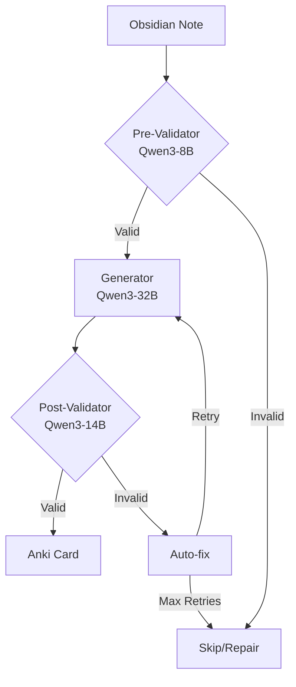

# Obsidian to Anki APF Sync Service

Synchronize Obsidian Q&A notes to Anki flashcards using LLM-powered generation with multi-agent validation.

[]()
[]()
[](https://github.com/psf/black)

## Features

- **Multi-Provider LLM Support**: Ollama, LM Studio, OpenAI, Anthropic, OpenRouter
- **Multi-Agent System**: Three-stage validation (pre-validation → generation → post-validation)
- **Privacy-First**: Optional 100% local processing with Ollama
- **Bidirectional Sync**: Create, update, delete, restore cards
- **Bilingual Support**: English/Russian cards
- **Security**: Path traversal protection, symlink prevention, API key validation
- **Resumable Syncs**: SQLite state management with progress tracking

## Multi-Agent Architecture



**Benefits**: 15-20% faster (early rejection), higher quality, automatic error correction, 100% local processing.

## Quick Start

### Installation

```bash
# Install dependencies
curl -LsSf https://astral.sh/uv/install.sh | sh
git clone https://github.com/po4yka/obsidian-to-anki.git
cd obsidian-to-anki
uv sync --all-extras
source .venv/bin/activate
```

### Anki Setup

1. Install [Anki](https://apps.ankiweb.net/)
2. Install AnkiConnect addon: Tools → Add-ons → Get Add-ons (code: `2055492159`)
3. Restart Anki

### Configuration

Choose your LLM provider:

**Option 1: Ollama (Local/Privacy)**
```bash
brew install ollama
ollama serve
ollama pull qwen3:8b qwen3:14b qwen3:32b
```

**Option 2: OpenAI**
```bash
export OPENAI_API_KEY="sk-..."
```

**Option 3: Anthropic**
```bash
export ANTHROPIC_API_KEY="sk-ant-..."
```

Create `config.yaml`:
```yaml
vault_path: "~/Documents/ObsidianVault"
source_dir: "Notes"
anki_deck_name: "My Deck"

llm_provider: "ollama"  # or "openai", "anthropic", "openrouter", "lm_studio"

# For Ollama
use_agent_system: true
pre_validator_model: "qwen3:8b"
generator_model: "qwen3:32b"
post_validator_model: "qwen3:14b"

# For OpenAI (uncomment if using)
# generator_model: "gpt-4-turbo-preview"
# post_validator_model: "gpt-4"
# pre_validator_model: "gpt-3.5-turbo"
```

### Usage

```bash
# Full sync
obsidian-anki-sync sync

# Dry run (preview changes)
obsidian-anki-sync sync --dry-run

# With agents
obsidian-anki-sync sync --use-agents

# Test run (5 random notes)
obsidian-anki-sync test-run --count 5
```

## Providers Comparison

| Provider | Type | Best For | Setup |
|----------|------|----------|-------|
| **Ollama** | Local | Privacy, offline | `brew install ollama` |
| **OpenAI** | Cloud | GPT-4 quality | API key |
| **Anthropic** | Cloud | Claude 3 quality | API key |
| **LM Studio** | Local | GUI preference | Download app |
| **OpenRouter** | Cloud | Multi-model access | API key |

## System Requirements

**Agent System (Ollama)**:
- Mac M3/M4 with 32GB+ RAM
- 25GB storage for models
- ~600-1200 cards/hour

**Cloud APIs**:
- Any system with internet
- No local requirements
- Cost per token

## Commands

```bash
obsidian-anki-sync sync              # Full synchronization
obsidian-anki-sync init              # Initialize config
obsidian-anki-sync validate <file>   # Validate note structure
obsidian-anki-sync decks             # List Anki decks
obsidian-anki-sync export            # Export to .apkg
```

## Development

```bash
# Code formatting
uv run black . && uv run isort .

# Linting
uv run ruff check .

# Type checking
uv run mypy src/

# Testing
uv run pytest --cov
```

## Security Features

- **Path Validation**: Prevents `..` traversal, symlink attacks
- **API Key Validation**: Provider-specific checks at startup
- **Resource Cleanup**: Proper context managers for DB connections
- **Specific Exceptions**: No bare `except:` blocks

## Troubleshooting

**Ollama not connecting**:
```bash
curl http://localhost:11434/api/tags
ollama serve
```

**AnkiConnect not responding**:
1. Ensure Anki is running
2. Check addon: Tools → Add-ons
3. Verify port: default `8765`

**Import errors**:
```bash
uv sync --all-extras
```

## Documentation

- [Agent Integration Plan](.docs/AGENT_INTEGRATION_PLAN.md)
- [Security Best Practices](#security-features)
- [Provider Guide](docs/LLM_PROVIDERS.md)
- [APF Format](.docs/APF_FORMAT.md)
- [Refactoring Guide](REFACTORING_GUIDE.md)

## Contributing

1. Fork repository
2. Create feature branch
3. Make changes
4. Run tests: `uv run pytest`
5. Format: `uv run black . && uv run isort .`
6. Submit PR

## License

MIT License - see [LICENSE](LICENSE)

## Acknowledgments

Built with [Typer](https://typer.tiangolo.com/), [Rich](https://rich.readthedocs.io/), [Ollama](https://ollama.ai/), and [Qwen3](https://huggingface.co/Qwen).

---

**Need help?** [Open an issue](https://github.com/po4yka/obsidian-to-anki/issues)
