# Obsidian to Anki APF Sync Service

Synchronize Obsidian Q&A notes to Anki flashcards using LLM-powered generation with multi-agent validation.

[]()
[]()
[]()
[](https://github.com/astral-sh/ruff)
[](https://opensource.org/licenses/MIT)

## Features

-   **🔄 Bidirectional Sync**: Full synchronization between Obsidian notes and Anki cards
-   **🤖 Multi-Agent LLM System**: Advanced agent orchestration with LangGraph and PydanticAI
-   **🌐 Multi-Provider Support**: Ollama, OpenAI, Anthropic, OpenRouter, LM Studio
-   **🧠 Memory-Enhanced Learning**: Continuous quality improvement through pattern learning
-   **🔒 Privacy-First Architecture**: 100% local processing option with Ollama
-   **🌍 Bilingual Support**: English/Russian content with automatic language detection
-   **📊 Progress Tracking**: Resumable syncs with detailed progress reporting
-   **🛡️ Security First**: Path validation, API key protection, input sanitization
-   **📈 Quality Assurance**: Multi-stage validation with auto-fix capabilities
-   **🔍 RAG Integration**: Retrieval-augmented generation for enhanced context
-   **📋 Batch Operations**: Efficient bulk processing with transaction rollback
-   **🎯 APF v2.1 Compliance**: Strict adherence to Anki Prompts Format specifications
-   **📊 Validation Suite**: Comprehensive note validation and repair tools

## Table of Contents

-   [Features](#features)
-   [Multi-Agent Architecture](#multi-agent-architecture)
-   [System Architecture](#system-architecture)
-   [Data Flow](#data-flow)
-   [Quick Start](#quick-start)
-   [Providers Comparison](#providers-comparison)
-   [System Requirements](#system-requirements)
-   [Commands](#commands)
-   [Development](#development)
-   [Security Features](#security-features)
-   [Troubleshooting](#troubleshooting)
-   [Documentation](#documentation)
-   [Contributing](#contributing)
-   [License](#license)

## Multi-Agent Architecture


**Key Benefits**:

-   **🚀 Performance**: 15-20% faster through early rejection
-   **🎯 Quality**: Multi-stage validation with auto-correction
-   **🔄 Resilience**: Automatic retry with different strategies
-   **🧠 Learning**: Pattern recognition improves over time
-   **🔒 Privacy**: 100% local processing with Ollama

## System Architecture


## Memory-Enhanced Learning

The system includes advanced memory capabilities that continuously improve card quality:

-   **Pattern Recognition**: Learns successful card generation patterns per topic
-   **User Preferences**: Adapts to individual user preferences for card style and difficulty
-   **Quality Feedback**: Uses memorization quality assessments to optimize future generations
-   **Intelligent Routing**: Automatically selects the best AI agent framework per content

**Memory Benefits**: 20-30% quality improvement, personalized generation, continuous learning.

## Data Flow


See [Agent System](.docs/ARCHITECTURE/agents.md) for detailed documentation.

## Quick Start

### Prerequisites

-   **Python 3.13+**
-   **Anki** with AnkiConnect plugin
-   **uv** package manager (recommended) or pip

### Setup Flow


### Installation

```bash
# Install uv (if not already installed)
curl -LsSf https://astral.sh/uv/install.sh | sh

# Clone and setup
git clone https://github.com/po4yka/obsidian-to-anki.git
cd obsidian-to-anki
uv sync --all-extras
source .venv/bin/activate

# Alternative with pip
pip install -e .
```

### Anki Setup

1. Install [Anki](https://apps.ankiweb.net/)
2. Install AnkiConnect addon: Tools → Add-ons → Get Add-ons (code: `2055492159`)
3. Restart Anki

### Configuration

#### 1. Choose Your LLM Provider

**Local/Privacy (Recommended)** - Ollama:

```bash
brew install ollama
ollama serve
ollama pull llama3.2:3b qwen2.5:7b qwen2.5:14b
```

**Cloud Providers** - OpenAI:

```bash
export OPENAI_API_KEY="sk-..."
```

**Cloud Providers** - Anthropic:

```bash
export ANTHROPIC_API_KEY="sk-ant-..."
```

#### 2. Create Configuration File

Create `config.yaml` in your project directory:

```yaml
# Vault Configuration
vault_path: "~/Documents/ObsidianVault"
source_dir: "Notes"
anki_deck_name: "My Deck"

# LLM Provider Settings
llm_provider: "ollama" # Options: ollama, openai, anthropic, openrouter, lm_studio

# Agent System Configuration
use_langgraph: true # Use advanced LangGraph orchestration
use_pydantic_ai: true # Use structured AI responses

# Model Configuration (adjust based on your provider)
pre_validator_model: "llama3.2:3b" # Fast, lightweight model
generator_model: "qwen2.5:14b" # Main generation model
post_validator_model: "qwen2.5:7b" # Quality validation

# Optional: Override models for specific providers
# generator_model: "gpt-4-turbo-preview"  # For OpenAI
# generator_model: "claude-3-5-sonnet-20241022"  # For Anthropic
```

### Usage

```bash
# Full synchronization
obsidian-anki-sync sync

# Dry run (preview changes without applying them)
obsidian-anki-sync sync --dry-run

# Incremental sync (only changed notes)
obsidian-anki-sync sync --incremental

# Test run with sample notes
obsidian-anki-sync test-run --count 5

# Validate note structure
obsidian-anki-sync validate "path/to/note.md"
```

## Providers Comparison

```mermaid
graph TD
    subgraph "Local Providers"
        A[Ollama<br/>🐧 Privacy-first<br/>📁 Offline capable<br/>⚡ Fast inference<br/>💾 High RAM usage]
        B[LM Studio<br/>🖥️ GUI interface<br/>🎨 User-friendly<br/>🔧 Local models<br/>⚙️ Easy setup]
    end

    subgraph "Cloud Providers"
        C[OpenAI<br/>🤖 GPT-4 quality<br/>🌐 Always available<br/>💰 Token-based pricing<br/>🔒 Enterprise security]
        D[Anthropic<br/>🧠 Claude excellence<br/>📊 Safety-focused<br/>💎 Premium quality<br/>🔑 API key required]
        E[OpenRouter<br/>🔄 Multi-model access<br/>🛒 Model marketplace<br/>💵 Cost optimization<br/>🎯 Best value]
    end

    A --> F{Choose Based On:}
    B --> F
    C --> F
    D --> F
    E --> F

    F --> G[Privacy Needs<br/>→ Ollama]
    F --> H[GUI Preference<br/>→ LM Studio]
    F --> I[Quality Priority<br/>→ Anthropic]
    F --> J[Cost Optimization<br/>→ OpenRouter]
    F --> K[Simplicity<br/>→ OpenAI]

    style A fill:#e8f5e8
    style B fill:#e3f2fd
    style C fill:#fff3cd
    style D fill:#f8d7da
    style E fill:#e2e3e5
```



## System Requirements

**Agent System (Ollama)**:

-   Mac M3/M4 with 32GB+ RAM
-   25GB storage for models
-   ~600-1200 cards/hour

**Cloud APIs**:

-   Any system with internet
-   No local requirements
-   Cost per token

## Commands

### Command Hierarchy


### Core Commands

```bash
obsidian-anki-sync sync              # Full synchronization
obsidian-anki-sync sync --dry-run    # Preview changes
obsidian-anki-sync sync --incremental # Only process changed notes
obsidian-anki-sync test-run --count 5 # Test with N random notes
```

### Configuration & Setup

```bash
obsidian-anki-sync init              # Initialize configuration
obsidian-anki-sync check             # Pre-flight system checks
obsidian-anki-sync validate <file>   # Validate note structure
obsidian-anki-sync lint-note <file>  # Lint for bilingual completeness
```

### Anki Management

```bash
obsidian-anki-sync decks             # List available decks
obsidian-anki-sync models            # List note models (types)
obsidian-anki-sync model-fields <model> # Show field names for a model
obsidian-anki-sync export            # Export notes to .apkg file
obsidian-anki-sync export-deck       # Export Anki deck to YAML/CSV
obsidian-anki-sync import-deck       # Import cards from YAML/CSV
```

### Advanced Features

```bash
obsidian-anki-sync generate <term>   # Generate multiple card examples
obsidian-anki-sync process-file <file> # Process cards from file
obsidian-anki-sync index             # Show vault and Anki statistics
obsidian-anki-sync progress          # Show recent sync progress
obsidian-anki-sync clean-progress    # Clean up progress records
obsidian-anki-sync query <method>    # Direct AnkiConnect API queries
```

### RAG & Analysis

```bash
obsidian-anki-sync rag index         # Index content for RAG
obsidian-anki-sync rag search <query> # Search indexed content
obsidian-anki-sync analyze-logs      # Analyze log files
obsidian-anki-sync list-problematic-notes # List archived issues
```

## Development

### Code Quality

```bash
# Run all quality checks
uv run ruff format . && uv run isort . && uv run ruff check . && uv run mypy src/

# Or use the built-in format command
obsidian-anki-sync format
```

### Testing

```bash
# Run all tests with coverage
uv run pytest --cov

# Run specific test file
uv run pytest tests/test_parser.py

# Run tests with verbose output
uv run pytest -v

# Run only fast tests (skip integration)
uv run pytest -m "not integration"
```

### Development Commands

```bash
# Install in development mode
uv sync --all-extras

# Activate virtual environment
source .venv/bin/activate

# Run pre-commit hooks
uv run pre-commit run --all-files
```

## Security Features

-   **Path Validation**: Prevents `..` traversal, symlink attacks
-   **API Key Validation**: Provider-specific checks at startup
-   **Resource Cleanup**: Proper context managers for DB connections
-   **Specific Exceptions**: No bare `except:` blocks

## Troubleshooting

**Ollama not connecting**:

```bash
curl http://localhost:11434/api/tags
ollama serve
```

**AnkiConnect not responding**:

1. Ensure Anki is running
2. Check addon: Tools → Add-ons
3. Verify port: default `8765`

**Import errors**:

```bash
uv sync --all-extras
```

## Documentation

-   **[📚 Full Documentation](.docs/README.md)** - Complete guides and reference
-   **[🚀 Getting Started](.docs/GETTING_STARTED.md)** - Quick setup guide
-   **[🔧 Configuration](.docs/GUIDES/configuration.md)** - Model and provider setup
-   **[🔄 Synchronization](.docs/GUIDES/synchronization.md)** - Change management guide
-   **[🏗️ Architecture](.docs/ARCHITECTURE/README.md)** - System design overview
-   **[🃏 APF Format](.docs/ARCHITECTURE/apf.md)** - Card format specification
-   **[🤖 Agent System](.docs/ARCHITECTURE/agents.md)** - Multi-agent architecture
-   **[⚙️ LLM Providers](.docs/ARCHITECTURE/providers.md)** - Provider integration
-   **[🔍 Security Best Practices](#security-features)** - Security guidelines

## Contributing

We welcome contributions! Please follow these guidelines:

### Development Workflow


### Step-by-Step Guide

1. **Fork and Clone**

    ```bash
    git clone https://github.com/your-username/obsidian-to-anki.git
    cd obsidian-to-anki
    ```

2. **Set up Development Environment**

    ```bash
    uv sync --all-extras
    source .venv/bin/activate
    ```

3. **Create Feature Branch**

    ```bash
    git checkout -b feature/your-feature-name
    # or for bug fixes
    git checkout -b fix/issue-number-description
    ```

4. **Make Changes**

    - Follow the existing code style
    - Add tests for new functionality
    - Update documentation as needed
    - Ensure all tests pass

5. **Quality Checks**

    ```bash
    # Run all quality checks
    obsidian-anki-sync format
    uv run mypy src/
    uv run pytest --cov
    ```

6. **Commit Changes**

    ```bash
    git add .
    git commit -m "feat: add your feature description"
    ```

7. **Submit Pull Request**
    - Push your branch: `git push origin feature/your-feature-name`
    - Create PR with clear description
    - Reference any related issues

### Code Style Guidelines

-   **Python**: Follow PEP 8, use type hints, modern syntax (`list[str]` not `List[str]`)
-   **Commits**: Use conventional commits (`feat:`, `fix:`, `docs:`, `style:`, `refactor:`, `test:`, `chore:`)
-   **Documentation**: Update relevant docs in `.docs/` directory
-   **Tests**: Minimum 90% coverage, test both success and failure cases
-   **Security**: Never commit secrets, validate all inputs, use parameterized queries
